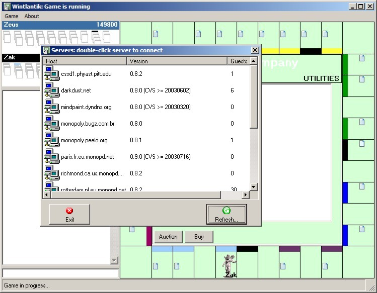



## A wintlantik 1\.4 monopoly client

### Description

This is Monopoly client for LINUX monopd servers. You can play monopoly with it over internet.

WARNING:If there is no servers list when you run the program, delete command line parameter (IP adress) in 'make' properties!!

If you want to trade estates, right-click on estate, wich you want to trade with.

If you just want money transactions, klik on target player's list of estates.

Atlantik has been originaly developed on LINUX, but since there ain't windows client...

Some things are to be done (smooth token moving, checking localhost server), but most of them comforms to monopd protocol.

For more info go to http://unixcode.org
 
### More Info
 
IP adress of server, if it is not on internet

             |
---                |---
**Submitted On**   |2003-08-28 10:14:24
**By**             |[Marjan](https://github.com/Planet-Source-Code/PSCIndex/blob/master/ByAuthor/marjan.md)
**Level**          |Advanced
**User Rating**    |4.0 (8 globes from 2 users)
**Compatibility**  |VB 6\.0
**Category**       |[Games](https://github.com/Planet-Source-Code/PSCIndex/blob/master/ByCategory/games__1-38.md)
**World**          |[Visual Basic](https://github.com/Planet-Source-Code/PSCIndex/blob/master/ByWorld/visual-basic.md)
**Archive File**   |[wintlantik1636618282003\.zip](https://github.com/Planet-Source-Code/marjan-a-wintlantik-1-4-monopoly-client__1-47974/archive/master.zip)

